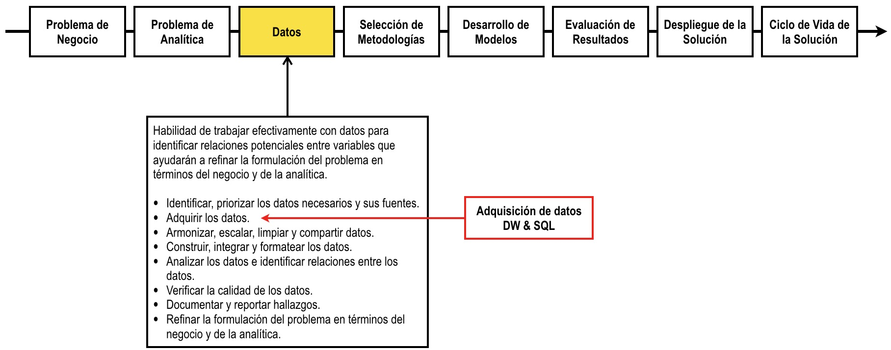

# Introducción al lenguaje SQL y el gestor de bases de datos relacionales MySQL

Haga click [aquí](http://nbviewer.jupyter.org/github/jdvelasq/SQL-for-analytics/tree/master/01-SQL/)
para visualizar este repositorio en nbviewer.

## Descripción

Una de las principales fuentes de datos en Analítica y Ciencia de los Datos son los
gestores de bases de datos relacionales, y es por ello que la comprensión del lenguaje SQL
es uno de los requerimientos básicos para el profesional del área. Este repo contiene un
tutorial introductorio a la programación en SQL usando el gestor MySQL.

El siguiente grafo muestra donde encaja este tutorial en el proceso.

## Objetivos

Al finalizar este tutorial el lector debe estar en capacidad de usar el lenguaje SQL para:

* Crear, manipular y borrar bases de datos y otras entidades.
* Realizar consultas de baja complejidad.
* Aplicar filtros y criterios de selección.  
* Insertar, borrar y modificar información.

## Requerimientos

Para realizar este tutorial usted debe tener instalados:

* [MySQL Community Edition](https://dev.mysql.com/downloads/mysql/)
* [Anaconda Python](https://www.anaconda.com/download/#macos)
* Y los paquetes:
   * [`ipython-sql`](https://github.com/catherinedevlin/ipython-sql).
   * `PyMySQL`.

Haga click [aquí](https://dev.mysql.com/doc/refman/5.6/en/installing.html) para acceder
a la guía de instalación de MySQL para diferentes sistemas operativos.

> Nota: Instale los paquetes con `pip install ipython-sql; pip install pymysql`.

## Información adicional

El shell de MySQL permite crear sesiones interactivas usando JavaScript, Python y SQL.

* [Instalador](https://dev.mysql.com/downloads/shell/).
* [Guía del usuario](https://dev.mysql.com/doc/mysql-shell-excerpt/5.7/en/).

Para cambiar el password de administrador use:

      SET PASSWORD FOR 'root'@'localhost' = PASSWORD('MyNewPass');

      ALTER USER 'root'@'localhost' IDENTIFIED BY 'MyNewPass';

En mac OS, para cambiar el valor de la variable. entre al directorio /Library/LaunchDaemons
y agregue la línea:

	 <string>—secure-file-priv=</string>

en el archivo 'com.oracle.oss.mysql.mysqld.plist'

---

**Juan David Velásquez Henao**    
jdvelasq@unal.edu.co  
Universidad Nacional de Colombia, Sede Medellín  
Facultad de Minas  
Medellín, Colombia  
[LinkedIn](https://co.linkedin.com/in/juan-david-velásquez-henao-94078979), [GitHub](https://github.com/jdvelasq), [ResearchGate](https://www.researchgate.net/profile/Juan_Velasquez8)

[Licencia](https://github.com/jdvelasq/SQL-for-analytics/tree/master/LICENSE)
