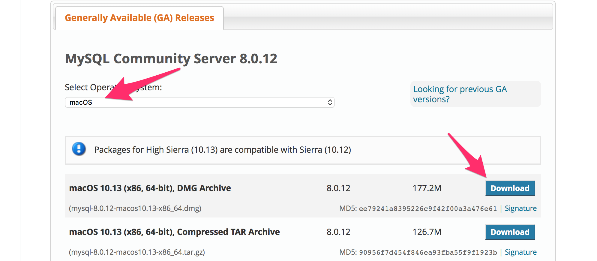
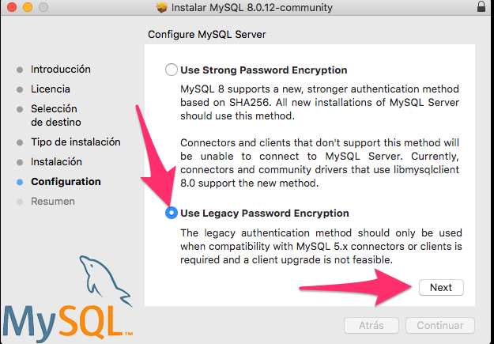
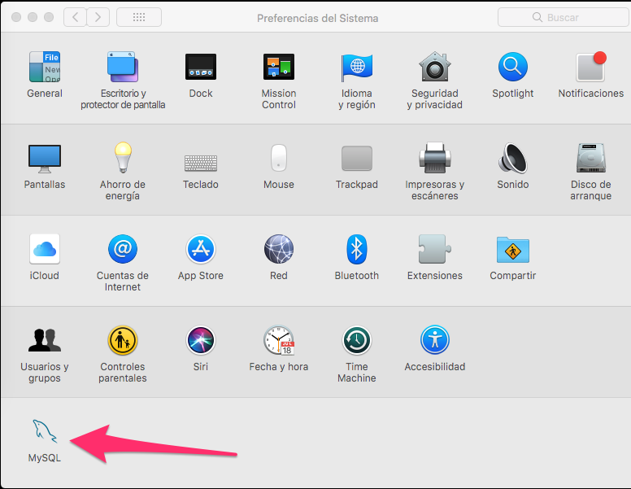
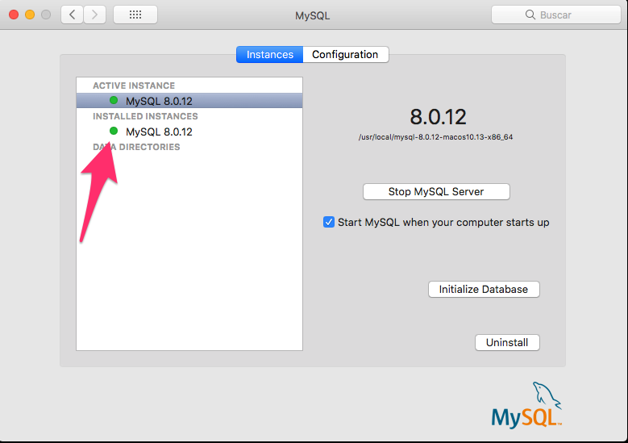
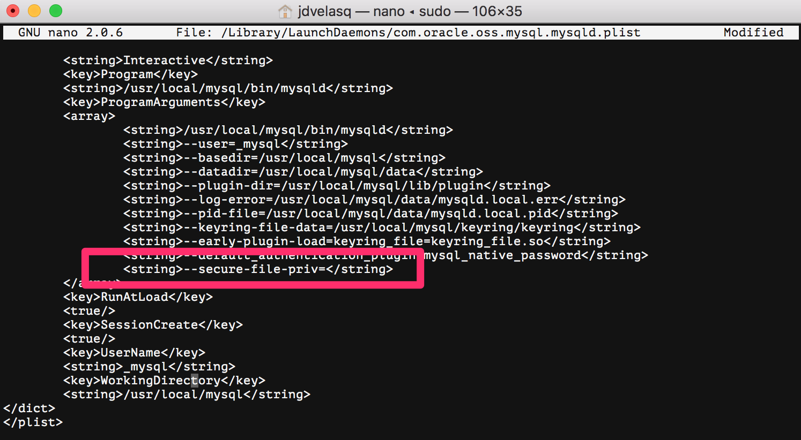

# Instalación y configuración de MySQL en Mac OS

Esta guía describe la instalación y configuración detallada de MySQL en MacOS y su conexión con Jupyter.

#### Paso 1 (Anaconda Python)
Descargue del sitio [https://www.continuum.io/downloads](https://www.continuum.io/downloads) el
instalador de Python 3.7.

#### Paso 2
Instale los paquetes requeridos para conectar `Jupyter` con el servidor.
```
pip install ipython-sql
```

```
pip install pymysql 
```

```
pip install traitlets
```
 
 
#### Paso 3
Descargue el instalador de MySQL Community Server. 

* Haga clic [aquí](https://dev.mysql.com/downloads/mysql/) para ir a la página del instalador. 


* Haga click [aquí](https://dev.mysql.com/doc/refman/5.6/en/installing.html) para acceder a la guía de instalación de MySQL para diferentes sistemas operativos.  


Verifique que el sistema operativo sea macOS y seleccione el archivo DMG.




Cuando llegue a la parte de **Configuration**, seleccione la opción **Use Legacy Password Encriptation**.



En la ventana siguiente debe establecer el password para el usuario `root`. Use como password la palabra `password` ya que los tutoriales usan esta clave para la conexión.

Finalice la instalación.

#### Paso 4
Verifique que el servidor de MySQL se esta ejecutado. Para ello, abra `Preferencias del Sistema` y haga clic en el ícono de MySQL.





Detenga la ejecución haciendo click en **Stop MySQL Server**. Los íconos deben cambiar a color rojo.


#### Paso 5
Abra Terminal que se encuentra ubicado en `Aplicaciones > Utilidades > Terminal`.


#### Paso 6
En Terminal digite el siguiente comando para editar el archivo de configuración de MySQL 

      sudo nano /Library/LaunchDaemons/com.oracle.oss.mysql.mysqld.plist

Agrege la siguiente linea de texto como se indica en la figura:

    <string>—-secure-file-priv=</string>




Salga del editor con `ctrl+X`, salvando el archivo.


#### Paso 7
Reinicie el servidor de MySQL en `Preferencias del Sistema`. El ícono debe ponerse verde.


